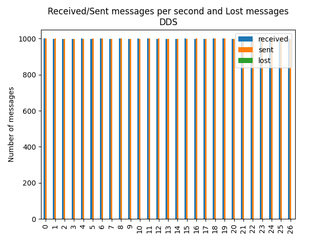
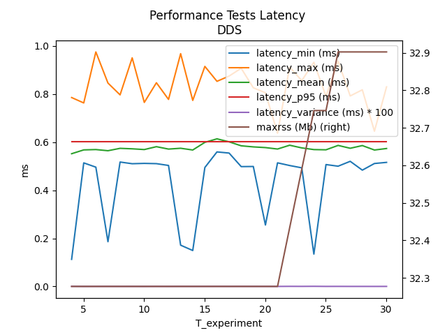
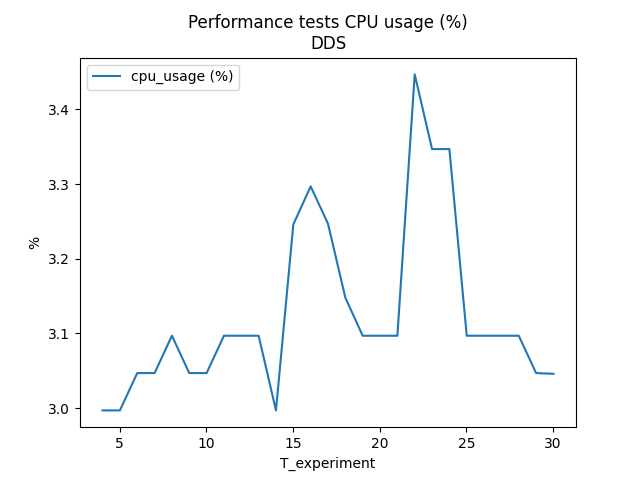

Apex AI - performance test: Log file Analysis Tool
===
Link: [Apex AI performance test][Apex_AI_performance_test_URL]

Require   
----
- python
- python lib
  - pyplot, pandas

How to use
--------
1. Make directory __log/experiment__
2. Move log files to 1. directory
3. Excute main.py
4. Check results in result directory

Samples
--------
  
 

[Apex_AI_performance_test_URL]: https://github.com/ros2/buildfarm_perf_tests

