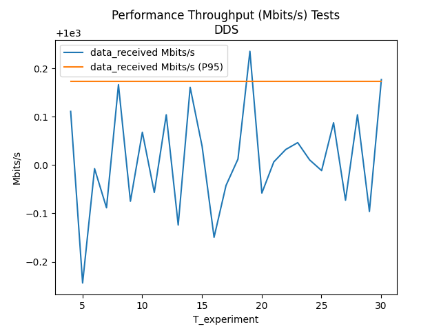

Apex AI - performance test: Log file Analysis Tool
===
Link: [Apex AI performance test][Apex_AI_performance_test_URL]

Require   
----
- python
- python lib
  - pyplot, pandas

How to use
--------
1. Make directory __log/experiment__
2. Move log files to 1. directory
3. Excute main.py
4. Check results in result directory

Samples
--------
```
{
  "average_single_trip_time": {
    "dblValue": 35.81884615384615,
    "unit": "ms"
  },
  "throughput": {
    "dblValue": 2.931340841146616,
    "unit": "Mbit/s"
  },
  "max_resident_set_size": {
    "dblValue": 41624.0,
    "unit": "MB"
  },
  "received_messages": {
    "dblValue": 2.1153846153846154
  },
  "sent_messages": {
    "dblValue": 2.1923076923076925
  },
  "lost_messages": {
    "intValue": 0.0
  },
  "cpu_usage": {
    "dblValue": 0.591725,
    "unit": "percent"
  }
}
```

  
 


[Apex_AI_performance_test_URL]: https://github.com/ros2/buildfarm_perf_tests

